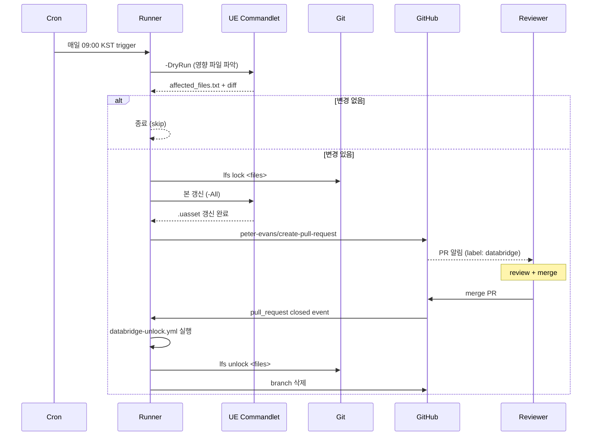

# DataBridge — GitHub Actions 워크플로우 예제

DataBridge 갱신을 CI 파이프라인에서 자동화하는 예제. 이 폴더의 YAML 파일을 사용 프로젝트의 `.github/workflows/`로 **복사한 뒤 환경에 맞게 수정**해서 사용.

---

## 파일 목록

| 파일 | 용도 |
|---|---|
| `databridge-update.yml` | 스케줄(cron) / 수동 dispatch로 갱신 + PR 자동 생성 |
| `databridge-unlock.yml` | PR 머지 시 LFS 락 해제 |

두 파일은 짝으로 동작합니다 — `update`가 PR을 만들고, `unlock`이 머지 후 정리.

---

## 설치 (5단계)

### 1. Self-hosted runner 준비

UE Editor 실행이 필요하므로 **GitHub-hosted runner는 비현실적**입니다 (UE 설치 + license + binary 사이즈). Self-hosted runner에 다음이 설치돼 있어야 합니다:
- UE Editor 5.6+
- Git + Git LFS
- PowerShell 5.1 이상 (Windows 기본)

Runner에 라벨 추가 (`self-hosted`, `windows`, `ue-5.6`).

### 2. 워크플로우 파일 복사

```
프로젝트/
├── .github/
│   └── workflows/
│       ├── databridge-update.yml       ← 여기에 복사
│       └── databridge-unlock.yml       ← 여기에 복사
└── Plugins/DataBridge/
```

### 3. 환경값 수정

`databridge-update.yml`의 다음 변수를 본인 환경으로:

```yaml
env:
  UE_CMD: 'C:\Program Files\Epic Games\UE_5.6\Engine\Binaries\Win64\UnrealEditor-Cmd.exe'
  PROJECT_PATH: '${{ github.workspace }}\YourProject.uproject'   # ← 프로젝트명
```

`runs-on` 라벨도 본인 runner에 맞춰:
```yaml
runs-on: [self-hosted, windows, ue-5.6]
```

### 4. Repository 권한 설정

Settings → Actions → General → Workflow permissions:
- **Read and write permissions** 활성화
- **Allow GitHub Actions to create and approve pull requests** 체크

(또는 PAT 시크릿으로 대체 — 보안 강화 시 권장)

### 5. 라벨 생성

Issues/PR 라벨 페이지에서 `databridge`, `auto-update` 두 개 생성. (`databridge-unlock.yml`이 이 라벨로 PR 필터링)

---

## 동작 흐름



---

## 트리거 방식

### A) 스케줄 (cron)
```yaml
schedule:
  - cron: '0 0 * * *'   # 매일 UTC 00:00 = KST 09:00
```

UTC 기준이라 한국 시간 보정 필요. `crontab.guru`에서 확인 권장.

### B) 수동 dispatch
GitHub UI → Actions → "DataBridge Auto-Update" → "Run workflow" 버튼.

`source_name`, `environment` 입력값을 폼으로 받음:
```yaml
workflow_dispatch:
  inputs:
    source_name:
      description: 'Source name (or "All")'
      default: 'All'
```

### C) 외부 webhook
시트 변경 webhook을 받아 `repository_dispatch` 이벤트 발행 → 워크플로우 트리거. (별도 구성 필요)

---

## 락 해제 시점

`databridge-update.yml`에서 락 획득 → PR 생성. **머지될 때까지 락 유지**. 머지되면 `databridge-unlock.yml`이 자동 해제.

이렇게 하는 이유:
- PR review 중에 다른 사람이 같은 파일 수정하면 merge 충돌
- 락 유지로 그 시간 동안 동시 수정 차단
- 머지 후 즉시 해제

머지 안 되고 close된 경우 (rejected) — 락이 남음. **수동 해제** 필요:
```bash
git lfs unlock --force Content/Data/DT_Foo.uasset
```

또는 `databridge-unlock.yml`을 확장해서 closed (not merged) 케이스도 처리하게 수정 가능.

---

## 커스터마이징

### Slack 알림

```yaml
- name: Notify Slack
  if: always()
  uses: slackapi/slack-github-action@v1
  with:
    payload: |
      {
        "text": "DataBridge update: ${{ job.status }}"
      }
  env:
    SLACK_WEBHOOK_URL: ${{ secrets.SLACK_WEBHOOK }}
```

### 자동 머지 (review 없이)

⚠️ **권장 안 함** — 자동 커밋의 함정에 다시 빠짐. 그래도 신뢰할 만한 환경이면:
```yaml
- name: Enable auto-merge
  run: gh pr merge --auto --squash ${{ steps.cpr.outputs.pull-request-number }}
  env:
    GH_TOKEN: ${{ secrets.GITHUB_TOKEN }}
```

### Reviewer 자동 지정

```yaml
- name: Request reviewers
  uses: peter-evans/create-pull-request@v6
  with:
    reviewers: alice,bob
    team-reviewers: data-team
```

### 다른 CI 시스템 (GitLab, Jenkins)

원리는 동일:
1. 스케줄 트리거
2. `UnrealEditor-Cmd.exe -run=DataBridgeUpdate -DryRun`로 변경 파악
3. LFS 락
4. 본 갱신
5. Merge Request / Pull Request 생성
6. 머지 후 락 해제

GitHub Actions YAML을 GitLab CI YAML로 옮기는 건 syntax 변환 정도. 핵심 로직은 같음.

---

## 트러블슈팅

### "Workflow does not have permission to create pull request"
→ Step 4 권한 설정 누락. Repository Settings → Actions → Workflow permissions 확인.

### Self-hosted runner에서 UE 명령이 안 됨
→ runner 서비스를 실행하는 사용자에게 UE Editor 실행 권한 + 라이선스 설정 필요. 보통 runner를 service로 실행하면 desktop session 없어서 UE가 안 뜸 — interactive session으로 실행하거나 특수 설정 필요.

### LFS 락 충돌이 자주 발생
→ 작업 시간을 분산. cron 시각을 팀이 작업 안 하는 시간대로 (예: 새벽). 또는 락 충돌 시 retry 로직 추가.

### PR이 너무 많이 쌓임
→ 직전 PR이 머지/close 되기 전엔 새 PR 안 만들도록 가드:
```yaml
- name: Check existing PR
  run: |
    $existing = gh pr list --label databridge --state open --json number
    if ($existing -ne "[]") {
      Write-Host "Existing databridge PR found, skipping."
      exit 0
    }
```

---

## 참고

- 사용 라이브러리: [`peter-evans/create-pull-request`](https://github.com/peter-evans/create-pull-request)
- 메인 README: `../../README.md`
- 스크립트 사용법: `../Scripts/README.md`
